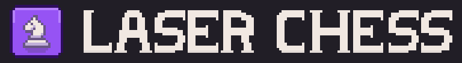

# Laser Chess - the Python mobile game
A university Python course project based on modified laser chess

    

## Used resources
- [Pixel chess asset pack by Brysia](https://brysiaa.itch.io/pixel-chess-assets-pack)
- [Knight icon](https://www.flaticon.com/free-icon/horse_864637?term=chess&page=1&position=26&origin=tag&related_id=864637)
